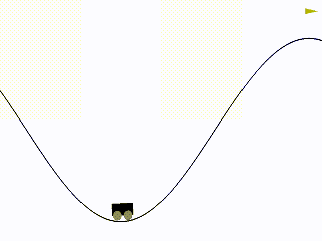

# MountainCar v0 OpenAI Gym

**Episodes required to train:** 100-200

**Time to train:** 3-10 minutes

**Algorithm used:** Double Deep Q Learning (DDQN)

### Details
By default, the environment comes with a limit of 200 steps per episode. To make it easier for the agent to learn, I use something like Curriculum Learning. First, the maximum number of steps is set to 1500 to allow the agent to explore easier. When it learns to reach the target, the maximum is reduced to 500, then to 200. After that, the reward function is updated.

**Reward function 1:**
~~~python
def compute_reward_state0(car_position):
    reward = 0
    if car_position >= g_goal_pos:
        reward = 10 ** 2
    elif car_position >= 0.9:
        reward = 10 ** (-1)
    elif car_position >= 0.8:
        reward = 10 ** (-2)
    elif car_position >= 0.7:
        reward = 10 ** (-3)
    elif car_position >= 0.6:
        reward = 10 ** (-4)
    elif car_position >= 0.5:
        reward = 10 ** (-6)
    elif car_position >= 0.4:
        reward = 10 ** (-7)

    return reward
~~~

**Reward function 2:**
~~~python
def compute_reward_state1(car_position):
    reward = -1
    if car_position >= g_goal_pos:
        reward = 10 ** 2

    return reward
~~~

### Conclusion
It takes quite a bit of time to train. I couldn't think of a better way to solve the reward problem. Maybe Selective Experience replay could've worked better.

---
Feel free to open issues with suggestions
